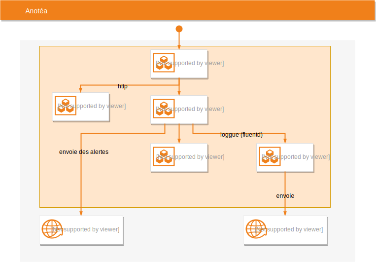

# Architecture technique

En production l'application est démarrée dans des containers Docker.

- Un container `nginx`, reverse proxy qui est le point d'entrée de l'application pour tous les appels http
- Un container `backend` contenant le serveur node.js
- Un container `ui` contenant les interfaces graphiques
- Un container `mongodb`  
- Un container `fluentbit` pour gérer les logs



Quand un appel HTTP arrive au niveau du reverse proxy `nginx`, en fonction de l'url demandée l'appel est transmis soit au container `backend` soit au container `ui`. Les règles sont spécifiées [ici](../docker/nginx/app/nginx/conf.d/locations.inc)

## Structure des projets

Anotea est composé de deux projets : `backend` et `ui`.

### Backend

Les rôles du backend sont les suivants :

- Exposition des apis
- Envoi des emails
- Execution des jobs (import...)
- Affichage du site web (home)

Le projet backend est découpé en trois parties : core, http et jobs.

#### Core

La partie core `backend/src/core` contient tous les fichiers commun.

On y trouve les utilitaires `backend/src/core/utils`. Les utilitaires sont en règle générale des fonctions qui fournissent des outils pour manipuler les nombres, les streams,...

On y trouve également les composants `backend/src/core/components.js` qui sont des objets 'complexes'. On entend par complexe des objets qui vont, par exemple, se connecter à la base de données ou envoyer des emails. 

En java, on pourrait comparer ces objets à des beans Spring. L'intégralité des composants representant alors un context applicatif.

Les composants sont injectés dans toutes les routes et les jobs de l'application

On peut prendre comme exemple le composant `emails` qui pourra être injecté dans les routes ou les jobs afin d'envoyer facilement des emails.

```js
//Injection du composant emails dans un job
execute(async ({ emails }) => {
     let message = emails.getEmailMessageByTemplateName('...');
     await message.send(...);
});
```

#### HTTP

La partie core `backend/src/http` contient tous les fichiers permettant de créer le serveur HTTP.

Le point d'entrée est le fichier `backend/src/http/server.js`.
On y configure un serveur `express` en ajoutant des middlewares et des routes.

Il y a deux types de routes :
- `site` qui regroupent toutes les routes permettant d'afficher le site web (home) et qui renvoie du HTML.
- `api` qui regroupent toutes les routes liées aux APIs (`v1`,`backoffice`,`questionnaire`,...) et qui renvoie du json.

#### Jobs

La partie core `backend/src/jobs` contient tous les fichiers permettant d'executer des traitement sur les données.

On y trouve les jobs permettant d'importer les stagiaires, d'envoyer des emails, de réconcilier les avis...

Le point d'entrée de chaque job est le suivant `backend/src/job/<nom>/index.js`.

Pour lancer un job en ligne de commande, il faut lancer la commande suivante :

```bash
node src/jobs/data/migration
```

### UI

Les rôles du projet UI sont les suivants :

- Affichage du widget
- Affichage des backoffices
- Affichage du questionnaire

Ce projet se base sur l'outil [create-react-app](https://github.com/facebook/create-react-app) et est donc une single page application.

Il est découpé en trois parties : `backoffice`, `widget`, `questionnaire`.

Chaque partie est constituée des répertoires suivants :
- `components` qui regroupe les composants React.
- `services` que contient les services faisant appellent aux APIs exposées par le backend.
- `utils` que contient des outils réutilisables
